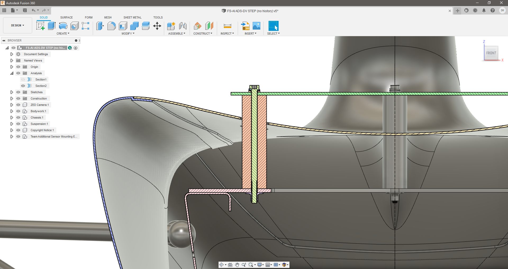

# FS-AI_ADS-DV_CAD

## Introduction

This repository contains CAD data for the IMechE FS-AI ADS-DV for release to participating teams.

The CAD provided is a subset of the whole vehicle CAD and is intended for sensor installation and vehicle dynamics modelling purposes.

In particular teams wishing to fit additional sensors to a shared IMechE ADS-DV must use this CAD data to gain approval for their installation design. (See section 'Additional Sensor Mounting CAD Submission and Approval' below).

This CAD data remains Copyright IMechE 2020 and must not be uploaded to alternate public access web / cloud locations. This is both to protect copyright and to ensure there is one 'official' source for CAD data that may be up-issued by the IMechE as necessary. Local clones are encouraged to make it easy for updates to be pulled from the upstream repository using Git.

The URL for this repository is: https://github.com/FS-AI/FS-AI_ADS-DV_CAD

If you are not accessing this repository directly from this URL then likely you are working from a fork or clone which may not contain the latest data or information. If you have made a local clone, please ensure you do a 'git pull' to ensure you have the latest version of all files.

## Updates

The repository will be updated regularly in response to questions and as new information is confirmed and released. Github allows you to 'Watch' the repository so as to be informed of activity.

## Questions

Please use the Github 'Issues' feature to ask questions regarding this repository. Please label your issue with the tag 'question'.

Best efforts will be made to answer all questions but please allow a few days for a response.

## Content

The repository consists of the following files:

- 'Readme.md' - this file containing information about the repository.
- '\images' - folder containing the images for 'Readme.md'.
- 'FS-AI_ADS-DV_CAD.f3d' - see below.
- 'FS-AI_ADS-DV_CAD.step' - see below.

### Fusion 360 File 'FS-AI_ADS-DV_CAD.f3d'

This file is provided in native Fusion 360 format, which means it preserves sketch details, section analysis details and other useful data such as construction geometry.

Fusion 360 is available free-of-charge for non-commercial or educational use. Full details at: https://www.autodesk.co.uk/products/fusion-360/personal

See also this video for information on how to correctly activate the Personal edition of Fusion 360 instead of the 30 day free trial: https://www.youtube.com/watch?v=qJABXBvuoB4&ab_channel=DesktopMakes

### STEP File 'FS-AI_ADS-DV_CAD.step'

This file is a STEP format export of the Fusion 360 file. STEP is a universal file format for import into other CAD packages.

One disadvantage of the STEP format is that it does not preserve the sketch details of the Front and Side view relating to the Surface Envelope definition and the ZED camera sight line. You will need to replicate this sketch geometry within your own CAD package. See the images below.

This STEP file has been tested with FreeCAD v0.19, available here: https://www.freecadweb.org/

## Sketch Views

### Side View

In the case of using the STEP file, see below for the details of the sight line of the ZED camera and the Rule T 1.1.16 Surface Envelope in side view.

The ZED camera reference angle is 15deg below horizontal. A normal line projected from the centre of the front face of the ZED camera will intersect the ground plane approximately 2750mm from the camera position.

Formula Student Rule T 1.1.16 defines a 'Surface Envelope' in side view from the top of the roll hoop to the outer profile of the tyres. Rule DV 4.1.3 further requires that all sensors be located within this surface envelope. Since the ADS-DV does not have a traditional roll hoop, the envelope is defined from the outer profile of the TSAL dome instead. The tyre profile is projected as a 515mm diameter circle on the vehicle centreline.

### Front View

In the case of using the STEP file, see below for the details of the Rule T 1.1.16 Surface Envelope in front view.

Formula Student Rule T 1.1.16 defines a 'Surface Envelope' in front view from the top of the roll hoop to the outer profile of the tyres. Rule DV 4.1.3 further requires that all sensors be located within this surface envelope. Since the ADS-DV does not have a traditional roll hoop, the envelope is defined from the outer profile of the TSAL dome instead. The tallest point on the tyre profile is used.

### Section View

In the case of using the STEP file the Analysis - Section2 view is not available and is reproduced in the screenshot below.

The nominal reference design for an Additional Sensor Mounting is a plate spaced 100mm up from the internal chassis using 26mm (or 1.0") diameter spacer pillars. A 120mm M6 bolt is required to ensure sufficient thread engagement into the M6 nut plates of the chassis. A metal spring lock washer and plain metal backing washer are required to ensure the integrity of the mounting.

The full Additional Sensor Mounting requirements are discussed below.

## Additional Sensor Mounting

Teams wishing to mount additional sensors to the ADS-DV must adhere to the following requirements:

### Surface Envelope (Rules T 1.1.16 & DV 4.1.3)

Additional Sensors and all mounting hardware **must** fit within both the Side View and Front View Surface Envelopes defined above.

### Mounting Requirements

The nominal reference design for an Additional Sensor Mounting is a plate spaced 100mm up from the internal chassis using 26mm (or 1.0") diameter spacer pillars. This is provided as an example in the CAD data. The example uses all 5 available mounting locations.

Alternate designs are permissible and will be evaluated as part of the approval process.

To safely and securely mount additional sensors the following requirements must be respected:

- **At least 3** mounting pillar locations **must be used**, out of the 5 available.
- The **only permissible mounting option** is a full-length M6 bolt clamping the mounting structure down onto the vehicle chassis plate. Concepts with more than one thread risk the 'wrong' thread releasing when the additional sensors are removed.
- All clamping surfaces must be parallel to the vehicle chassis plate.
- Metal spring lock washers must be used, backed up with metal plain washers, to ensure sufficient clamping force and integrity of mounting.
- All components must be rigid enough to allow the metal spring lock washers to compress completely when the M6 bolts are tightened.
- 12mm of M6 thread engagement is required below the top face of the vehicle chassis plate.
- Unimpeded vertical access to the M6 bolt heads must be available to allow access for a socket (16mm OD) or hex driver.

#### Note on AV mounts:

Grommet type AV mounts may be used to isolate an additional sensor mounting plate as long as the rigid clamping requirement is respected. It must be possible to fully compress the M6 metal spring washer. This is best achieved using 'top hat' spacers or a rigid spacer tube:

### Mounting Locations

The pattern of the position of the mounting locations is as follows:

The mounting holes are M6 threaded, and the 30mm diameter represents the clearance holes in the bodywork.

#### ToDo:

Example 3D printed mounting plate, showing parallel clamping surfaces, metal spring lock washers and metal plain backing washers.

## Additional Sensor Electrical Connections

The electrical connector location for additional sensors is somewhat flexible and will be confirmed once all teams have submitted an initial design for approval. The preferred location is in the region circled on the image below:

The wiring harness on the vehicle side will allow for a range of movement within this approximate zone. Connecting and disconnecting will be done by moving the vehicle side wiring harness. However additional sensor mounting designs **must allow for strain relief of both sides of the connected wiring**. The strain relief on the vehicle side of the connector(s) should be adjustable for cable diameter and easily removeable. A screwed down cable tie base is the recommended option:

### Vehicle Side Connectors

The vehicle side connectors are described below. All images are **vehicle side connector** you need to supply and fit the **opposite mating connector** to your additional sensor installation.

#### Power

- 1x TE DT06-2S power connector supplying automotive ‘12V’ (11.5 ->14.5V depending on battery charge state) up to 5A:

Mating part number TE DT04-2P.

#### Ethernet

- 2x Ethernet Cat6 cables with the standard RJ45 connector running from 2 Ethernet sockets on the InCarPC:

#### USB3.0

- 2x USB3.0 Type A sockets connected via a powered USB3.0 hub to the InCarPC:

#### CAN

- 1x DE9 connector for CAN on the vehicle. It will be receptacle type, pin contacts and internal thread:

## Additional Sensor Mounting CAD Submission for Approval

Teams wishing to fit additional sensors to a shared IMechE ADS_DV **must submit CAD data** of their proposed design for approval. Teams should have requested additional sensors on their 'DCS' form with full details provided for review in their 'ASF' document. Team leaders should already have been contacted by email with details of this process and contact details for submission. A 'zip' archive should be used to contain all data, labelled with team identification and a version number.

The CAD data should place the sensor mounting design in the correct position **within the CAD data provided in this repository** and include the following components / information:

- All additional sensor hardware (space-claim / box models are fine, internal detail is not required).
- Sensor mounting structural components **including spacer tubes.**
- M6 fasteners including all washers.
- All fasteners used to mount sensor hardware, or a description of the mounting technique used (e.g. 3M Dual Lock).
- Information on component materials and manufacturing process.
- Information and / or models regarding the proposed wiring scheme, connector location(s) and the **cable strain relief implementation**.

NOTE: it is the responsibility of the team to provide **all additional sensor mounting components**, nothing is provided with the vehicle except the M6 threaded holes in the vehicle chassis plate.

CAD data file format should be either native Fusion 360 ('.f3d') or STEP ('.stp' / '.step').

Supplementary information should be provided as either a PDF or Markdown file.

